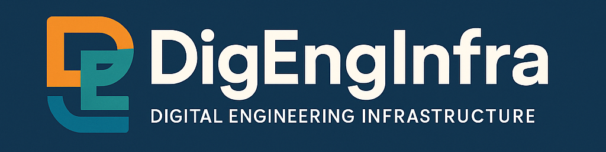

# Welcome to Digital Engineering for Infrastructure 

## Introduction 

Digital Engineering for Infrastructure (DigEngInfra) is an organisation aimed at
improving and sharing knowledge of Digital Engineering, BIM and Information
Management Solutions and Techniques for the Civil Infrastructure Community.
